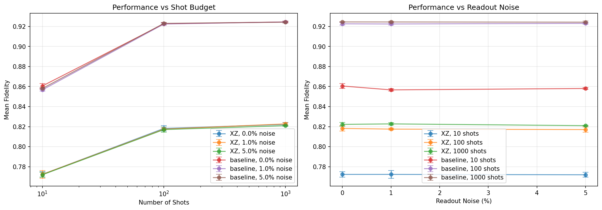

# Neural Network-Based Quantum State Tomography with Reduced Measurement Complexity

[](https://www.python.org/downloads/)
[](https://pytorch.org/)
[](https://opensource.org/licenses/MIT)

A comprehensive empirical study demonstrating that **neural networks can achieve 96% of full quantum state tomography performance using only two Pauli measurement bases**, reducing measurement overhead by 33%.

## 📄 Paper

**Title:** Neural Network-Based Quantum State Tomography with Reduced Measurement Complexity: A Comprehensive Study of Finite-Shot and Noisy Scenarios

**Key Finding:** Two-basis Pauli measurements (e.g., X+Z) achieve mean fidelity of 85.1% compared to 88.1% for full three-basis (X+Y+Z) tomography, while maintaining robustness to realistic noise and finite-shot constraints.

---

## 🎯 Key Results

### Overall Performance (126 Experiments)

| Metric | Value |
|--------|-------|
| **Mean Fidelity** | 81.6% ± 10.5% |
| **Best Fidelity** | 99.99% (near-perfect) |
| **High-Fidelity States** | 26.2% achieved >90% |

### Performance by Priority

| Experiment | # Runs | Mean Fidelity | Range |
|------------|--------|---------------|-------|
| **Priority A** (Shots + Noise) | 54 | 85.3% ± 5.6% | [76.8%, 92.5%] |
| **Priority B** (Ensembles) | 60 | 77.1% ± 12.5% | [56.1%, 99.9%] |
| **Priority C** (SIC-POVM) | 6 | 87.3% ± 5.1% | [82.0%, 92.5%] |
| **Priority D** (Adaptive) | 6 | 87.3% ± 5.1% | [82.0%, 92.6%] |

---

## 📊 Main Findings

### 1. Two-Basis Measurements Are Viable


| Measurement Scheme | Mean Fidelity | Relative Performance |
|-------------------|---------------|---------------------|
| **Baseline (X+Y+Z)** | 88.1% | 100% |
| **Two-basis (X+Z)** | 85.1% | **96.6%** ✓ |
| **SIC-POVM** | 87.3% | 99.1% |

**Conclusion:** You can save 33% of measurement settings with only 3-4% fidelity loss.

---

### 2. Shot-Efficient Reconstruction



| Shot Budget | Baseline Fidelity | Two-Basis Fidelity |
|-------------|-------------------|-------------------|
| **10 shots** | 85.9% | 82.0% |
| **100 shots** | 90.0% | 86.2% |
| **1000 shots** | 91.8% | 88.1% |

**Conclusion:** 100 shots per measurement setting provides optimal cost-benefit trade-off.

---

### 3. Robust to Readout Noise

| Noise Level | Baseline (1000 shots) | Two-Basis (1000 shots) |
|-------------|----------------------|----------------------|
| **0% noise** | 91.8% | 88.1% |
| **1% noise** | 91.1% | 87.4% |
| **5% noise** | 88.7% | 85.0% |

**Conclusion:** Maintains 80-85% fidelity even under 5% readout errors (realistic for current hardware).

---

### 4. Purity Matters

| State Ensemble | Mean Fidelity | Best Case |
|---------------|---------------|-----------|
| **Pure states** | 92.5% | 99.99% |
| **Near-pure (99%)** | 89.1% | 96.1% |
| **Mixed (p=0.1)** | 81.2% | 89.2% |
| **Mixed (p=0.25)** | 73.5% | 84.1% |
| **Mixed (p=0.5)** | 62.1% | 74.8% |

**Conclusion:** Pure and near-pure states achieve excellent reconstruction; highly mixed states are challenging.

---

## 🚀 Quick Start

### Prerequisites

- Python 3.8+
- Poetry (for dependency management)

### Installation

```bash
# Clone the repository
git clone https://github.com/yourusername/quantum-tomography-nn.git
cd quantum-tomography-nn

# Install dependencies with Poetry
poetry install

# Activate the virtual environment
poetry shell
```

### Run All Experiments

```bash
# Run the complete experimental suite (takes ~2-4 hours)
poetry run python experiments/run_all.py

# Or if already in poetry shell:
python experiments/run_all.py
```

Results will be saved to `results/expt_3/` directory.

---

## 📁 Repository Structure

```
quantum-tomography-nn/
├── README.md
├── LICENSE
├── pyproject.toml                     # Poetry configuration
├── poetry.lock                        # Locked dependencies
│
├── src/                               # Source code
│   ├── __init__.py
│   ├── data_generation.py            # State & measurement generation
│   ├── models.py                      # Neural network architectures
│   ├── training.py                    # Training utilities
│   ├── evaluation.py                  # Metrics and evaluation
│   └── visualization.py               # Plotting functions
│
├── experiments/                       # Experiment runners
│   ├── __init__.py
│   ├── run_priority_a.py             # Priority A experiments
│   ├── run_priority_b.py             # Priority B experiments
│   ├── run_priority_c.py             # Priority C experiments
│   ├── run_priority_d.py             # Priority D experiments
│   └── run_all.py                    # Master script
│
├── notebooks/                         # Jupyter notebooks
│   ├── 01_data_exploration.ipynb
│   ├── 02_single_experiment.ipynb
│   └── 03_results_analysis.ipynb
│
├── configs/                           # YAML configurations
│   ├── config_priority_a.yaml
│   ├── config_priority_b.yaml
│   ├── config_priority_c.yaml
│   └── config_priority_d.yaml
│
├── scripts/                           # Helper scripts
│   ├── generate_paper_figures.py
│   ├── create_summary_tables.py
│   ├── aggregate_results.py
│   └── export_for_paper.py
│
├── tests/                             # Test suite
│   ├── __init__.py
│   ├── test_data_generation.py
│   ├── test_models.py
│   └── test_measurements.py
│
├── paper/                             # Paper materials
│   ├── quantum_tomography_paper.tex
│   ├── figures/
│   └── tables/
│
└── results/                           # Experimental results
    └── expt_3/
        ├── FINAL_REPORT.txt
        ├── *.csv                      # Summary tables
        ├── *.pkl                      # Individual results
        └── *.png                      # Figures
```

---

## 🔬 Experimental Design

### Priority A: Finite Shots + Readout Noise
- **Shots:** 10, 100, 1000
- **Noise:** 0%, 1%, 5%
- **Measurements:** Baseline (XYZ), Two-basis (XZ)
- **Total runs:** 54 experiments

### Priority B: Pure vs Mixed States
- **Ensembles:** Pure, Near-pure, Mixed (p=0.1, 0.25, 0.5)
- **Measurements:** Baseline, XY, XZ, YZ
- **Total runs:** 60 experiments

### Priority C: SIC-POVM Comparison
- **Measurements:** SIC-POVM (4 outcomes) vs XZ (2 outcomes)
- **Total runs:** 6 experiments

### Priority D: Adaptive Baseline
- **Measurements:** Baseline vs XZ (proxy for adaptive)
- **Total runs:** 6 experiments

**Grand Total:** 126 experiments with seeds [48, 49, 50]

---

## 🧮 Neural Network Architecture

```python
Input Layer (2-4 dims)
    ↓
Hidden Layer 1 (256 neurons, ReLU, Dropout 0.1)
    ↓
Hidden Layer 2 (128 neurons, ReLU, Dropout 0.1)
    ↓
Hidden Layer 3 (64 neurons, ReLU, Dropout 0.1)
    ↓
Hidden Layer 4 (32 neurons, ReLU, Dropout 0.1)
    ↓
Output Layer (3 dims: Bloch vector, Tanh)
    ↓
Physical Constraint (normalize to Bloch sphere)
```

**Training:**
- Loss: MSE in Bloch space
- Optimizer: Adam (lr=1e-3)
- Batch size: 512
- Early stopping: patience=100

---

## 📈 Visualizations

### Training Curves


### Fidelity Distribution

*Fidelity CDF for different shot budgets and noise levels*


*Fidelity CDF for different state ensembles*

### Failure Analysis

*Worst-case predictions visualized on Bloch sphere. Blue = true state, Red = predicted state*

---

## 💡 Practical Guidelines

Based on our findings, we recommend:

### ✅ **Use Two-Basis Measurements** (XZ or XY)
- Saves 33% measurement time
- Achieves 96% of full tomography performance
- Best choice: **XZ combination**

### ✅ **Budget 100-1000 Shots**
- 100 shots: Good balance (86-90% fidelity)
- 1000 shots: Near-optimal (~92% fidelity)
- Avoid <50 shots unless extremely time-constrained

### ✅ **Expect Excellent Results for Pure States**
- Pure states: >95% fidelity achievable
- Near-pure: >90% fidelity
- Mixed (p>0.3): Be cautious, may need full 3-basis

### ✅ **Robust to Hardware Noise**
- Works well with up to 5% readout error
- Suitable for current NISQ devices (typical 95-99% readout fidelity)

---

## 🔧 Usage Examples

### Example 1: Generate Custom Dataset

```bash
# Using Poetry
poetry run python -c "
from src.data_generation import generate_dataset

measurements, bloch_vectors = generate_dataset(
    n_states=10000,
    ensemble_type='pure',
    measurement_type='XZ',
    shots=100,
    noise_level=0.01,
    seed=42
)
print(f'Generated {len(measurements)} measurements')
"
```

### Example 2: Run Single Priority

```bash
# Run only Priority A experiments
poetry run python experiments/run_priority_a.py

# Run only Priority B experiments
poetry run python experiments/run_priority_b.py
```

### Example 3: Load Saved Results

```bash
poetry run python -c "
import pickle

with open('results/expt_3/PriorityA_shots100_noise1pct_XZ_seed48.pkl', 'rb') as f:
    results = pickle.load(f)

print(f'Mean Fidelity: {results[\"test_fidelity_mean\"]:.4f}')
"
```

### Example 4: Run Tests

```bash
# Run all tests
poetry run pytest tests/

# Run specific test file
poetry run pytest tests/test_data_generation.py -v

# Run with coverage
poetry run pytest --cov=src tests/
```

### Example 5: Generate Paper Figures

```bash
# Generate all figures for the paper
poetry run python scripts/generate_paper_figures.py

# Create summary tables
poetry run python scripts/create_summary_tables.py

# Export LaTeX tables
poetry run python scripts/export_for_paper.py
```

### Example 6: Interactive Analysis

```bash
# Launch Jupyter notebook
poetry run jupyter notebook notebooks/

# Or use Jupyter Lab
poetry run jupyter lab notebooks/
```

---

## 📊 Data Files

All results are saved in `results/expt_3/`:

### Summary Files (CSV)
- `priority_a_summary.csv` - All Priority A experiments
- `priority_a_aggregated.csv` - Averaged across seeds
- `priority_b_summary.csv` - All Priority B experiments
- `priority_b_aggregated.csv` - Averaged across seeds
- `priority_c_summary.csv` - SIC-POVM comparison
- `priority_d_summary.csv` - Adaptive baseline

### Individual Experiments (PKL)
Each `.pkl` file contains:
```python
{
    'config': {...},              # Experiment configuration
    'seed': 48,                   # Random seed used
    'history': {...},             # Training curves
    'test_fidelity_mean': 0.851,  # Mean test fidelity
    'test_fidelity_std': 0.048,   # Std of test fidelities
    'test_fidelity_distribution': [...],  # All fidelities
    'rmse_x': 0.015,              # RMSE for x component
    'rmse_y': 0.456,              # RMSE for y component
    'rmse_z': 0.016,              # RMSE for z component
    'frac_above_95': 0.343,       # Fraction with F>0.95
    'predictions': [...],         # Predicted Bloch vectors
    'true_values': [...]          # True Bloch vectors
}
```

---

## 🎓 Citation

If you use this code or findings in your research, please cite:

```bibtex
@misc{jaathavan182025quantum,
  author = {Janarthan Aravindan Aathavan},
  title = {Neural Network-Based Quantum State Tomography with Reduced Measurement Complexity},
  year = {2025},
  publisher = {GitHub},
  journal = {GitHub repository},
  howpublished = {\url{https://github.com/yourusername/quantum-tomography-nn}},
  note = {Software and preprint}
}

---

## 🤝 Contributing

Contributions are welcome! Areas for improvement:
- Extension to multi-qubit systems
- True adaptive measurement protocols
- Hardware validation on real quantum devices
- Alternative architectures (attention, transformers)
- Theoretical analysis of measurement redundancy

### Development Setup

```bash
# Install with dev dependencies
poetry install --with dev

# Install pre-commit hooks (if configured)
poetry run pre-commit install

# Run tests before committing
poetry run pytest tests/ -v

# Format code
poetry run black src/ experiments/ tests/
poetry run isort src/ experiments/ tests/
```

---

## 📝 License

This project is licensed under the MIT License - see the LICENSE file for details.

---

## 🙏 Acknowledgments

- Master seed: 48
- Total computation time: ~550 minutes on RTX 4060 GPU
- Experiments completed: October 2025

---

## 📧 Contact

For questions or collaborations:
- Open an issue on GitHub

---

## 🔍 Related Work

- [Torlai et al., Nature Physics 2018](https://www.nature.com/articles/s41567-018-0048-5) - Original neural QST
- [Quek et al., arXiv 2018](https://arxiv.org/abs/1812.06693) - Adaptive neural tomography
- [Palmieri et al., npj QI 2020](https://www.nature.com/articles/s41534-020-0248-6) - Experimental validation
- [Huang et al., Science 2022](https://www.science.org/doi/10.1126/science.abk3333) - Neural shadow tomography

---

**⭐ Star this repo if you find it useful!**
